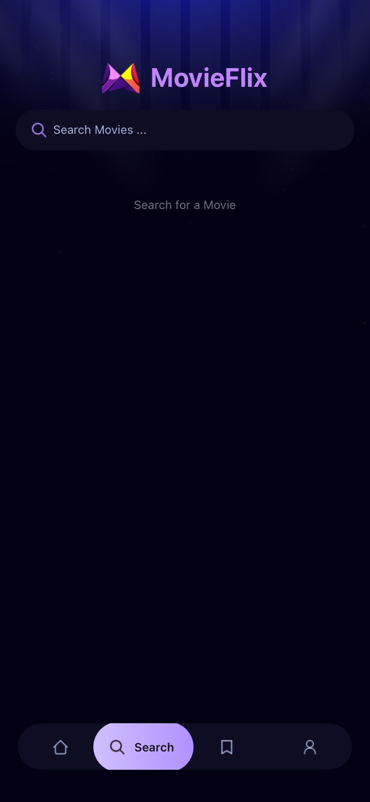
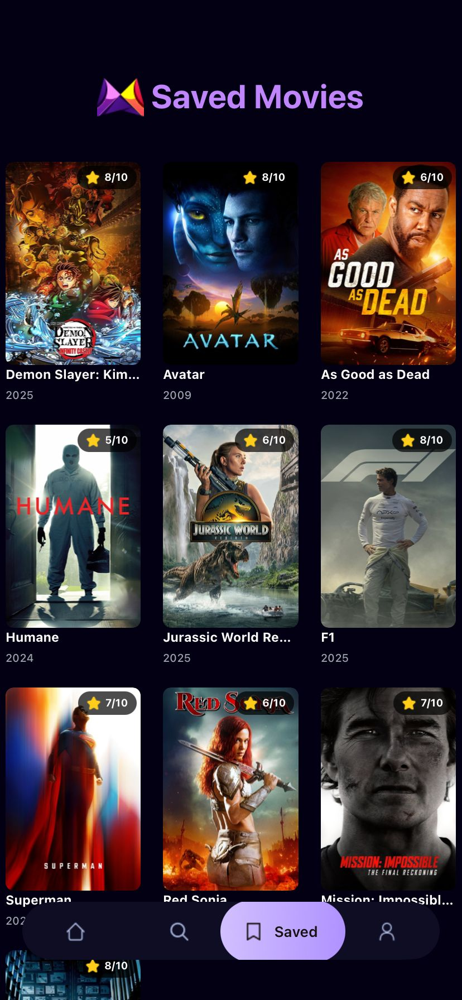
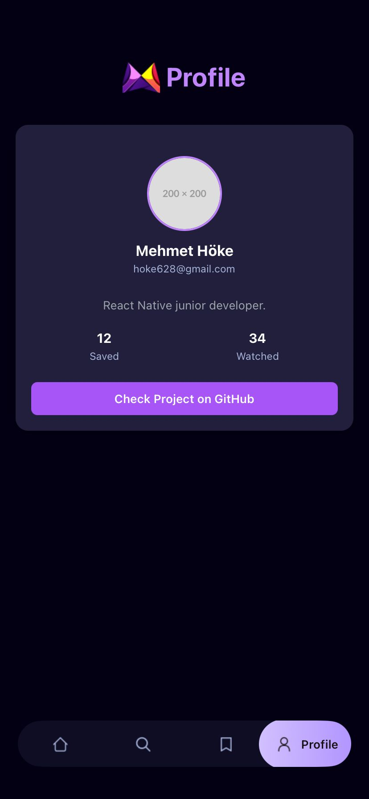

🎬 MovieFlix

MovieFlix, React Native + Expo ile geliştirilmiş, TMDB API ve Appwrite entegrasyonu sayesinde film arama, detay görüntüleme ve favorilere kaydetme özellikleri sunan bir mobil uygulamadır.

🚀 Özellikler

🔍 Film Arama: TMDB API üzerinden arama yaparak milyonlarca filme erişim.

📰 Trend Filmler: Popüler ve trend olan filmleri anasayfada listeleme.

❤️ Favorilere Kaydetme: Filmleri kaydet, istediğinde geri gel ve incele.

📂 Saved Sayfası: Kaydedilen filmleri gerçek zamanlı Appwrite veritabanından çekme.

📄 Film Detayları: Oyuncular, özet, IMDB puanı, çıkış tarihi gibi detay bilgileri gör.

🎨 Modern UI: Tailwind CSS (NativeWind) ile tasarlanmış sade ve şık arayüz.

🔒 (Gelecek) Kullanıcı giriş/çıkış sistemi (Appwrite Auth).

🛠 Kullanılan Teknolojiler

Frontend: React Native
 + Expo

Router: Expo Router

UI: NativeWind

Backend: Appwrite
 (Database & Auth)

API: TMDB API
 (Film bilgileri)

📦 Kurulum

Bu projeyi klonla:

git clone https://github.com/kullanici-adi/movieflix.git
cd movieflix

Bağımlılıkları yükle:

npm install

Ortam değişkenlerini ekle:
Proje köküne .env dosyası oluştur ve şu değerleri ekle:

EXPO_PUBLIC_MOVIE_API_KEY=TMDB_API_KEYIN
EXPO_PUBLIC_APPWRITE_PROJECT_ID=...
EXPO_PUBLIC_APPWRITE_DATABASE_ID=...
EXPO_PUBLIC_APPWRITE_COLLECTION_ID=...

Uygulamayı başlat:

npx expo start

📱 Ekran Görüntüleri

  
  

  
  

  
  

Anasayfa

Film Detayları

Kaydedilen Filmler (Saved)

Profil

🔮 Yol Haritası

 Film arama ve listeleme

 Film detay sayfası

 Kaydetme ve çıkarma (Appwrite DB)

👤 Geliştirici

Mehmet Höke

💼 Senior Mobil & Web Developer
